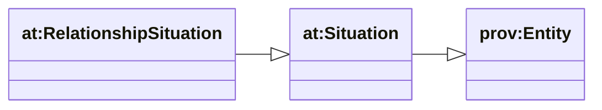
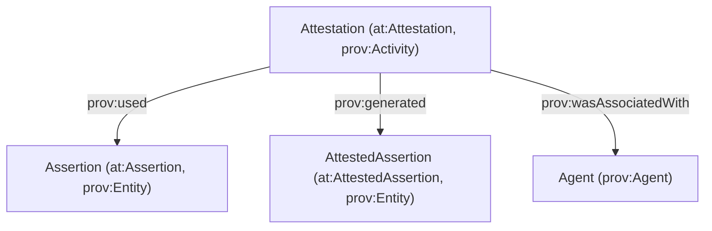

# Situation layer (DnS) — how trust + “being in” is modeled

This follows the AgenticTrust pattern described in the upstream docs.

Key point: **Situation is not an event**.

- `at:Situation` is a **`prov:Entity`**: “what is asserted/understood to hold”.
- `at:AssertionAct` / `at:Attestation` are **`prov:Activity`**: time-scoped acts that create durable records.
- `at:AttestedAssertion` is a **`prov:Entity`**: durable artifact generated by an accountable act.

## Situation hierarchy (subset used by ChurchCore)



## Assertion / attestation (PROV accountability)



## “Situation graph” overlay (query-friendly)

Even if different modules add their own specifics, you can usually query situations via:

- `at:isAboutAgent` (Situation → Agent the situation is “about”)
- `at:hasSituationParticipant` (Situation → participating agents)
- `at:qualifiedSituationParticipation` (Situation → participation node with role)

## SPARQL patterns

### Instances of Situation

```sparql
PREFIX rdfs: <http://www.w3.org/2000/01/rdf-schema#>
PREFIX at: <https://agentictrust.io/ontology/core#>

SELECT ?situation ?type
WHERE {
  ?situation a ?type .
  ?type rdfs:subClassOf* at:Situation .
}
ORDER BY ?type ?situation
LIMIT 200
```

### Situation participants + roles

```sparql
PREFIX at: <https://agentictrust.io/ontology/core#>

SELECT ?situation ?participant ?role
WHERE {
  ?situation at:qualifiedSituationParticipation ?p .
  ?p at:situationParticipant ?participant .
  OPTIONAL { ?p at:situationParticipantRole ?role }
}
LIMIT 200
```

