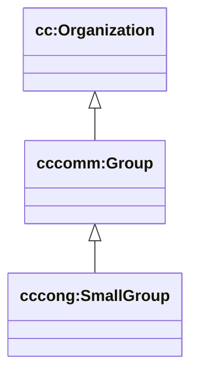

# ChurchCore-Congregation Ontology (deprecated)

This file is kept for backward links. Use `docs/ontology/README.md` instead.

This package is for **congregation-level ops ontology**: reusable local-church concepts (not church-specific instance seeds).

## Namespaces

- `cc:` → `https://ontology.churchcore.ai/cc#`
- `cccong:` → `https://ontology.churchcore.ai/cc/congregation#`

## Relationship to upper ontology

The local ontology imports:

- `https://ontology.churchcore.ai/cc/all` (master import of upper ontology modules)

Meaning:

- congregation ops instances can be typed with upper classes (`cc:Organization`, `cccomm:Group`, etc.)
- congregation ops terms are minted under `cccong:` without changing the upper ontology

## Diagram: local ops specialization



## Suggested conventions (for GraphDB instance data)

- **Instance IRIs**: use `https://id.churchcore.ai/...` (stable identifiers for exported data)
- **Named graph** per church: `https://churchcore.ai/graph/d1/<churchId>`
- **Local ontology** contains:
  - local instance anchors (church, campuses, ministry entities)
  - local shapes/conventions for D1→RDF mapping (when you want strict semantics)

## Example SPARQL queries (instance data)

### Get the church instance(s) by type

```sparql
PREFIX cc: <https://ontology.churchcore.ai/cc#>

SELECT ?church ?name
WHERE {
  ?church a cc:Church .
  OPTIONAL { ?church cc:name ?name }
}
LIMIT 50
```

### Query inside a D1 named graph

```sparql
PREFIX cc: <https://ontology.churchcore.ai/cc#>

SELECT ?person ?name
WHERE {
  GRAPH <https://churchcore.ai/graph/d1/calvarybible> {
    ?person a cc:Person ; cc:name ?name .
  }
}
ORDER BY LCASE(STR(?name))
```

