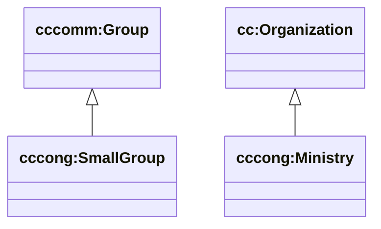

# Ops (cc/congregation) — small groups, ministries, facilities

Sources:

- wrapper: `ontology/churchcore-congregation.ttl` / `ontology/churchcore-congregation-all.ttl`
- T-Box: `ontology/tbox/ops.ttl`
- C-Box: `ontology/cbox/*` (ministry categories, service types, attendance statuses)

## Key classes (current)

- `cccong:SmallGroup` ⊑ `cccomm:Group`
- `cccong:Ministry` ⊑ `cc:Organization`
- `cccong:Facility` ⊑ `cc:Resource`
- `cccong:Room` ⊑ `cc:Resource`

## Diagram (subset)

## C-Box (starter)

Congregation categories are modeled as **instances** (SKOS Concepts) in the C-Box so they can evolve without changing schema.

Current schemes:

- `cc/congregation/cbox/ministry-categories`
- `cc/congregation/cbox/service-types`
- `cc/congregation/cbox/attendance-statuses`

