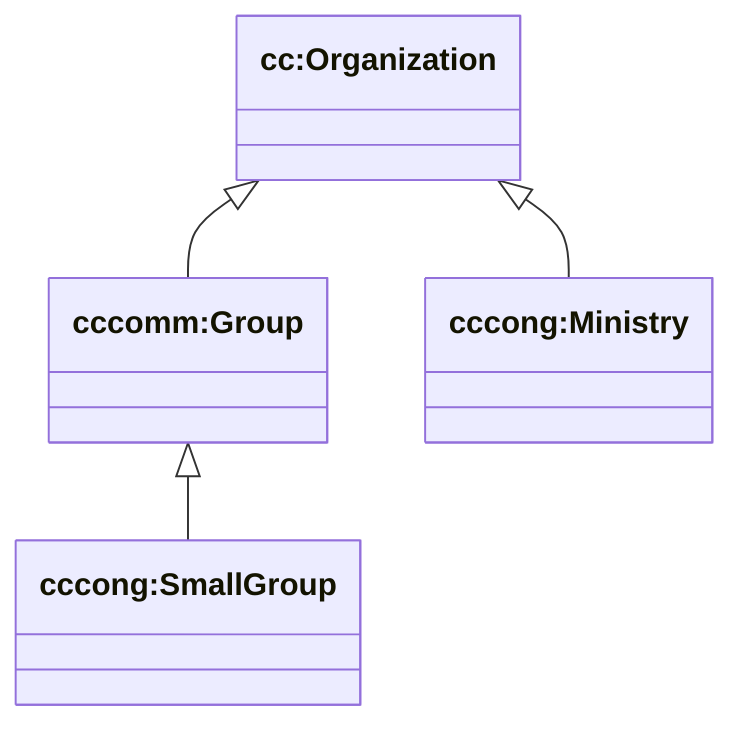

# ChurchCore-Congregation Ontology — overview

This package models **congregation-level ministry and operations** (Local‑C scope).

It extends the ChurchCore upper ontology with concepts that are *still reusable across many congregations*, but are not part of the faith-neutral upper layer.

## Semantic Arts boxes

- **T-Box** (`ontology/tbox/`): classes + properties (schema)
- **C-Box** (`ontology/cbox/`): category instances (service types, attendance statuses, ministry categories, etc.)
- **A-Box** (`ontology/abox/`): placeholder (instance data lives in GraphDB named graphs)

## Key schema (current)

- `cccong:SmallGroup` ⊑ `cccomm:Group`
- `cccong:Ministry` ⊑ `cc:Organization`
- `cccong:Facility` ⊑ `cc:Resource`
- `cccong:Room` ⊑ `cc:Resource`



## Query patterns

### Small groups (one row per group)

```sparql
PREFIX cc: <https://ontology.churchcore.ai/cc#>
PREFIX cccomm: <https://ontology.churchcore.ai/cc/community#>
PREFIX cccong: <https://ontology.churchcore.ai/cc/congregation#>

SELECT ?group (SAMPLE(?name) AS ?name)
WHERE {
  GRAPH <https://churchcore.ai/graph/d1/calvarybible> {
    ?group a cccomm:Group, cccong:SmallGroup .
    OPTIONAL { ?group cc:name ?name }
  }
}
GROUP BY ?group
ORDER BY LCASE(STR(SAMPLE(?name)))
LIMIT 500
```

