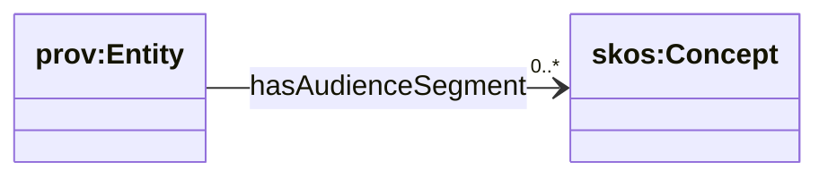

# Audience (global) — segments for discovery + benchmarking

Sources:

- T-Box: `ontology/tbox/audience.ttl`
- C-Box: `ontology/cbox/audience-segments.ttl`

This module provides **ecosystem-scale audience segmentation** (global scope) for:

- discovery queries (find orgs/programs relevant to a segment)
- benchmarking/cohorting (compare like-with-like)

## Diagram



## SPARQL: list all global audience segments

```sparql
PREFIX skos: <http://www.w3.org/2004/02/skos/core#>
PREFIX ccclass: <https://ontology.churchcore.ai/cc/class#>

SELECT ?segment ?label ?notation
WHERE {
  ?segment a skos:Concept ;
           skos:inScheme ccclass:AudienceScheme .
  OPTIONAL { ?segment skos:prefLabel ?label }
  OPTIONAL { ?segment skos:notation ?notation }
}
ORDER BY ?notation
LIMIT 500
```

## SPARQL: find orgs tagged to an audience segment

```sparql
PREFIX ccglobal: <https://ontology.churchcore.ai/cc/global#>
PREFIX ccclass: <https://ontology.churchcore.ai/cc/class#>

SELECT ?entity
WHERE {
  ?entity ccglobal:hasAudienceSegment ccclass:audience_students .
}
ORDER BY ?entity
LIMIT 200
```

