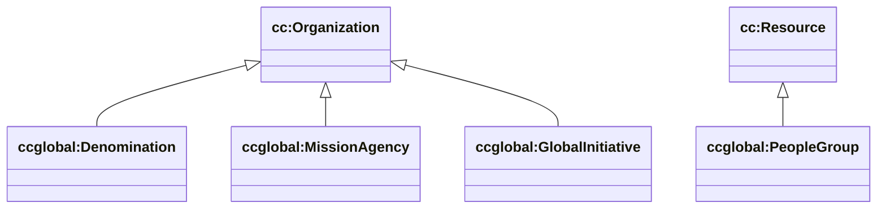

# Ecosystem (cc/global) — denominations, agencies, initiatives

Sources:

- wrapper: `ontology/churchcore-global.ttl` / `ontology/churchcore-global-all.ttl`
- T-Box: `ontology/tbox/ecosystem.ttl`

## Key classes

- `ccglobal:Denomination` ⊑ `cc:Organization`
- `ccglobal:MissionAgency` ⊑ `cc:Organization`
- `ccglobal:GlobalInitiative` ⊑ `cc:Organization`
- `ccglobal:Movement` ⊑ `cc:Organization`
- `ccglobal:Network` ⊑ `cc:Organization`
- `ccglobal:PeopleGroup` ⊑ `cc:Resource`

## Diagram (subset)

