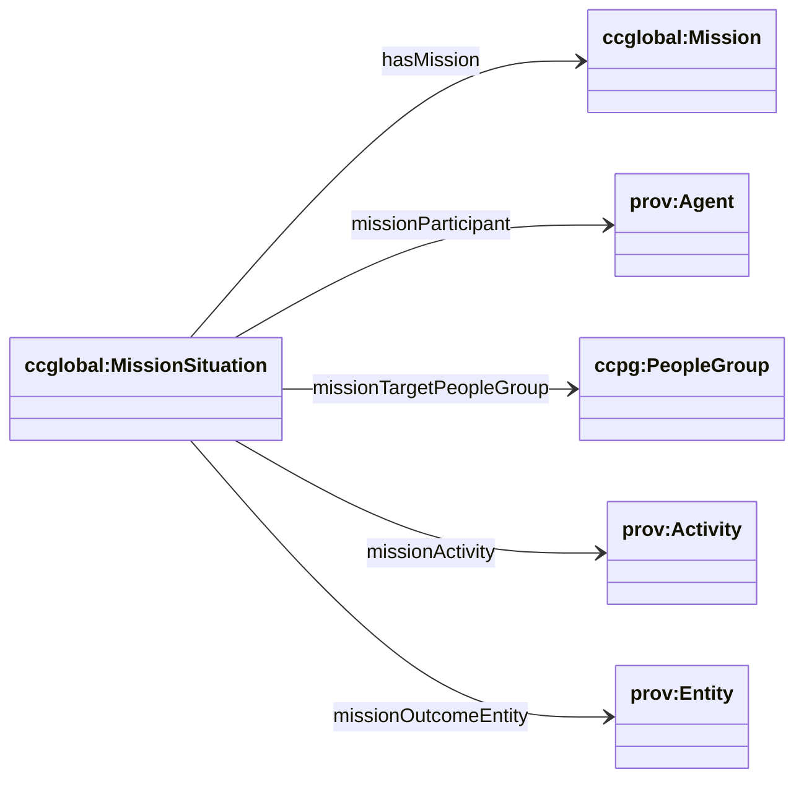

# Mission (cc/global) — Great Commission + MissionSituation

Sources:

- wrapper: `ontology/churchcore-global.ttl` / `ontology/churchcore-global-all.ttl`
- T-Box: `ontology/tbox/mission.ttl`
- C-Box: `ontology/cbox/mission-activity-types.ttl`

This module models Big‑C mission concepts with a DnS-style **MissionSituation** bridge that connects:

- mission plan/specification (`ccglobal:Mission`)
- participating agents (congregations, mission orgs, teams)\n+- target people groups\n+- mission activities\n+- outcome entities (often manifestation snapshots)

## Key classes

- `ccglobal:Mission` ⊑ `ccplan:Plan`
- `ccglobal:GreatCommissionMission` ⊑ `ccglobal:Mission`
- `ccglobal:MissionSituation` ⊑ `ccsit:ChurchSituation`
- `ccglobal:MissionSituationSpecification` ⊑ `ccsit:ChurchSituationSpecification`

## Relationship diagram (subset)



## SPARQL: list mission situations and targets

```sparql
PREFIX ccglobal: <https://ontology.churchcore.ai/cc/global#>

SELECT ?s ?mission ?pg
WHERE {
  ?s a ccglobal:MissionSituation .
  OPTIONAL { ?s ccglobal:hasMission ?mission }
  OPTIONAL { ?s ccglobal:missionTargetPeopleGroup ?pg }
}
LIMIT 200
```

