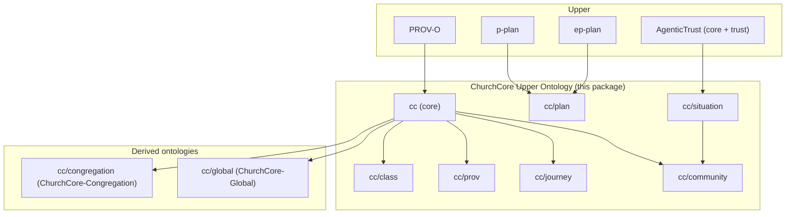

# ChurchCore ontology docs (upper)

This documentation is modeled after the AgenticTrust `docs/ontology` set:

- `https://github.com/agentictrustlabs/agent-explorer/tree/main/docs/ontology`

ChurchCore adds a church-domain upper ontology on top of:

- PROV-O (what happened)
- P-Plan + EP-PLAN (as-planned / plan-exec correspondence)
- AgenticTrust trust layer (DnS-style situations/roles/participation)

## Quick navigation

- `overview.md`: design patterns + layering + query patterns
- `core.md`: core classes + “specification vs execution” (ActivityRole)
- `situations.md`: ChurchSituation / MembershipSituation / RelationshipSituation
- `community.md`: Groups + GroupMembershipSituation
- `planning.md`: Plan/Step/Variable (P-Plan + EP-PLAN alignment)
- `journey.md`: Journey graph + per-person state/events
- `provenance.md`: source/derivation concepts
- `classifications.md`: controlled vocabularies (SKOS)
- `sparql-queries.md`: practical GraphDB queries against ChurchCore graphs

## Semantic Arts boxes (how files are organized)

- **T-Box** (`ontology/tbox/`): schema (classes + properties)
- **C-Box** (`ontology/cbox/`): category instances / controlled vocabularies
- **A-Box** (`ontology/abox/`): instance assertions (kept empty here; instance data lives in GraphDB named graphs)

The `ontology/churchcore-upper-*.ttl` files are **wrappers** (stable module IRIs) that `owl:imports` the relevant T-Box/C-Box artifacts.

## How ChurchCore instance data is stored in GraphDB

The Cloudflare sync writes instance triples into a named graph:

- `https://churchcore.ai/graph/d1/<churchId>`

In the current implementation, instance IRIs use:

- `https://id.churchcore.ai/...`

## Layering diagram

