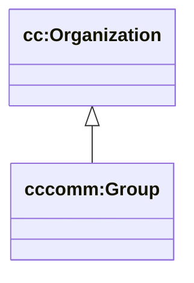

# Community (cc/community) — groups + membership

Sources:

- wrapper: `ontology/churchcore-upper-community.ttl`
- wrapper: `ontology/churchcore-upper-situations.ttl`
- T-Box: `ontology/tbox/community.ttl`

## Why groups are Organizations

`cccomm:Group` is modeled as a subtype of `cc:Organization` (an Agent), so groups can participate in situations and be “about” in the same way as people/orgs.

## Class hierarchy (subset)



Specializations like `cccong:SmallGroup` live in the derived **ChurchCore-Congregation** ontology.

## Membership situation (ChurchCore convenience links)

```mermaid
classDiagram
direction LR

class cccomm_GroupMembershipSituation["cccomm:GroupMembershipSituation"]
class cc_Person["cc:Person"]
class cccomm_Group["cccomm:Group"]

cccomm_GroupMembershipSituation --> cc_Person : cccomm:membershipPerson
cccomm_GroupMembershipSituation --> cccomm_Group : cccomm:membershipGroup
cccomm_GroupMembershipSituation --> xsd_string["xsd:string"] : cccomm:membershipStatus
```

## SPARQL: one row per person with groups (aggregated)

```sparql
PREFIX cc: <https://ontology.churchcore.ai/cc#>
PREFIX cccomm: <https://ontology.churchcore.ai/cc/community#>

SELECT
  ?person
  (SAMPLE(?personName) AS ?personName)
  (COUNT(DISTINCT ?group) AS ?groupCount)
WHERE {
  GRAPH <https://churchcore.ai/graph/d1/calvarybible> {
    ?person a cc:Person .
    OPTIONAL { ?person cc:name ?personName }
    OPTIONAL {
      ?m a cccomm:GroupMembershipSituation ;
         cccomm:membershipPerson ?person ;
         cccomm:membershipGroup ?group .
    }
  }
}
GROUP BY ?person
ORDER BY LCASE(STR(SAMPLE(?personName)))
LIMIT 500
```

## SPARQL: membership rows (person, group, status)

```sparql
PREFIX cc: <https://ontology.churchcore.ai/cc#>
PREFIX cccomm: <https://ontology.churchcore.ai/cc/community#>

SELECT ?person ?personName ?group ?groupName ?status
WHERE {
  GRAPH <https://churchcore.ai/graph/d1/calvarybible> {
    ?m a cccomm:GroupMembershipSituation ;
       cccomm:membershipPerson ?person ;
       cccomm:membershipGroup ?group .
    OPTIONAL { ?m cccomm:membershipStatus ?status }
    OPTIONAL { ?person cc:name ?personName }
    OPTIONAL { ?group cc:name ?groupName }
  }
}
ORDER BY LCASE(STR(?personName)) LCASE(STR(?groupName))
LIMIT 500
```

