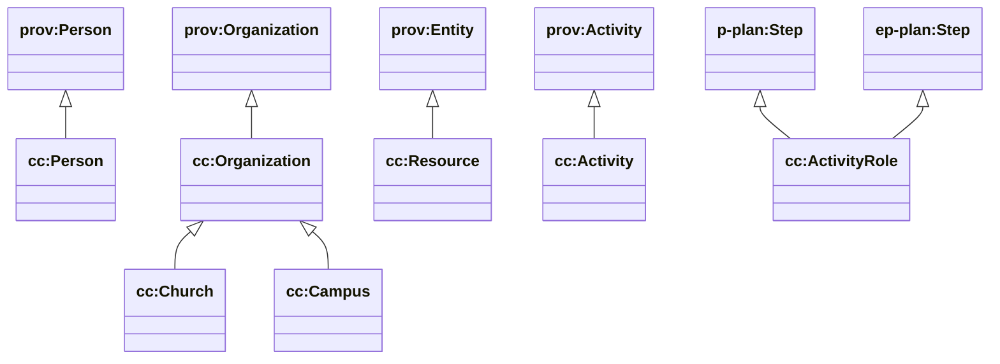

# Core (cc) — people, orgs, resources, activities

Sources:

- wrapper: `ontology/churchcore-upper-core.ttl`
- T-Box: `ontology/tbox/core.ttl`

## Key idea: “way things are done” vs “doing the thing”

RichCanvas-style separation:

- **Specification / template**: `cc:ActivityRole` (a Step in a plan)
- **Execution / occurrence**: `cc:Activity` (a PROV Activity)

This is the backbone for “plans vs actuals”, and for connecting church processes to outcomes.

## Class hierarchy (subset)



## Core relationships

```mermaid
classDiagram
direction LR

class cc_Activity["cc:Activity"]
class cc_ActivityRole["cc:ActivityRole"]

cc_Activity --> cc_ActivityRole : cc:correspondsToRole
```

## Data-facing properties (currently used by sync/export)

ChurchCore instance export uses (at least):

- `cc:name`
- `cc:description`

The Cloudflare D1→GraphDB sync also emits some application-friendly properties (email/phone/city/region, etc.). Those can be promoted into the ontology once stabilized.

