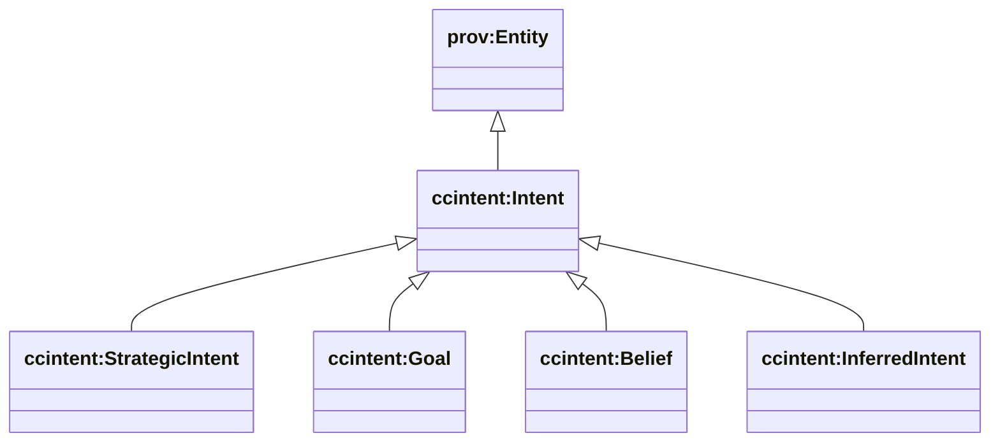
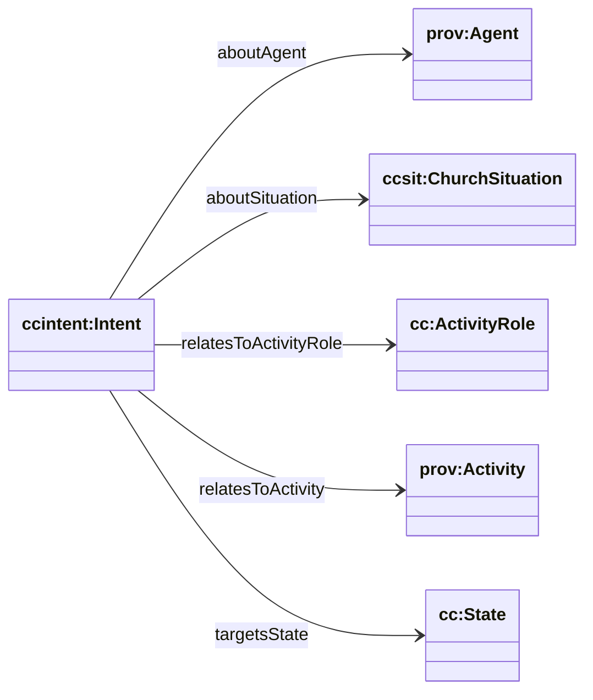

# Intent (cc/intent) — explicit + inferred intent

Sources:

- wrapper: `ontology/churchcore-upper-intent.ttl`
- T-Box: `ontology/tbox/intent.ttl`

This module is the missing “intent layer” from the website narrative:

- **Intent as a first-class artifact** (provenance-carrying, attributable)
- **Strategic intent** (purpose/mission/vision/strategy/goals/values/beliefs) typed via C-Box
- **Inferred intent** (evidence + confidence + inference provenance)

## Class hierarchy



## Relationship diagram (intent → spec/exec + state)



## How this uses C-Box

The upper C-Box already includes:

- `ccclass:StrategicIntentTypeScheme` (purpose/mission/vision/…)
- `ccclass:StrategicIntentLinkTypeScheme` (supports/drives/implements/measures)

`ccintent:StrategicIntent` instances should be categorized using these schemes via:

- `ccintent:hasStrategicIntentType`
- (optionally) reified linking with `ccintent:hasIntentLinkType`

## SPARQL: list inferred intents with confidence + evidence

```sparql
PREFIX ccintent: <https://ontology.churchcore.ai/cc/intent#>

SELECT ?intent ?confidence ?e ?a
WHERE {
  ?intent a ccintent:InferredIntent .
  OPTIONAL { ?intent ccintent:confidence ?confidence }
  OPTIONAL { ?intent ccintent:inferredFromEntity ?e }
  OPTIONAL { ?intent ccintent:inferredFromActivity ?a }
}
ORDER BY DESC(?confidence) ?intent
LIMIT 200
```

## SPARQL: intents targeting a state category

```sparql
PREFIX ccintent: <https://ontology.churchcore.ai/cc/intent#>
PREFIX cc: <https://ontology.churchcore.ai/cc#>

SELECT ?intent ?state
WHERE {
  ?intent a ccintent:Intent ;
          ccintent:targetsState ?state .
  ?state a cc:State .
}
ORDER BY ?intent
LIMIT 200
```

