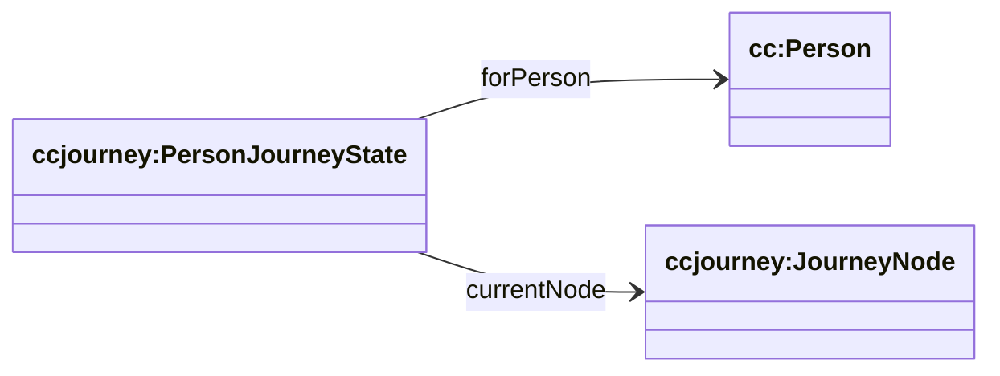

# Journey (cc/journey) — canonical graph + per-person state

Source:

- wrapper: `ontology/churchcore-upper-discipleship.ttl`
- T-Box: `ontology/tbox/journey.ttl`

ChurchCore separates:

- **canonical journey graph**: nodes + edges (“what the church believes the path can look like”)
- **per-person instance**: where a person is now + what happened

## Canonical graph


## Per-person state



## SPARQL: list journey nodes + their outgoing edges

```sparql
PREFIX cc: <https://ontology.churchcore.ai/cc#>
PREFIX ccjourney: <https://ontology.churchcore.ai/cc/journey#>

SELECT ?from ?fromName ?edge ?to ?toName
WHERE {
  GRAPH <https://churchcore.ai/graph/d1/example> {
    ?edge ccjourney:fromNode ?from ;
          ccjourney:toNode ?to .
    OPTIONAL { ?from cc:name ?fromName }
    OPTIONAL { ?to cc:name ?toName }
  }
}
LIMIT 500
```

