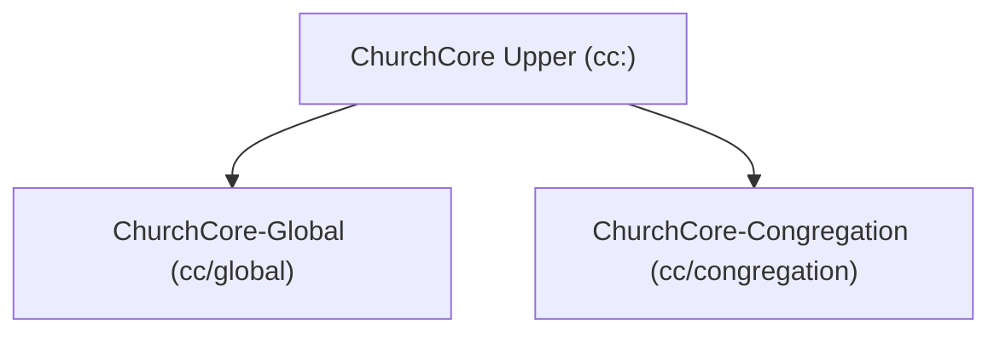
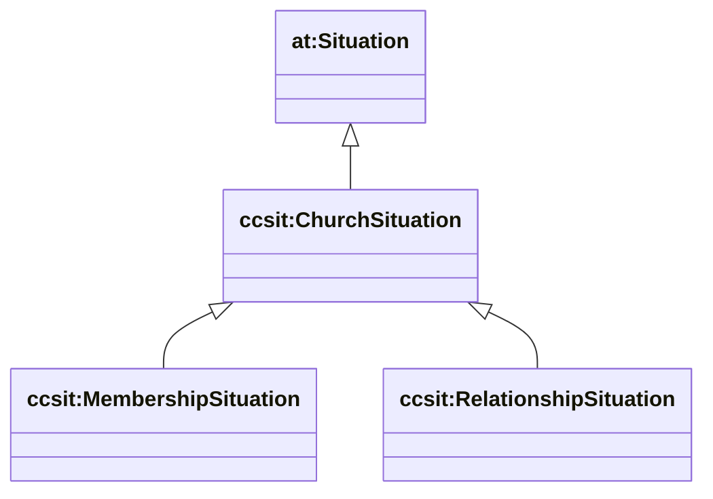

# ChurchCore Upper Ontology — overview

This package is the **faith-neutral upper ontology** for ChurchCore.

It defines the stable “grammar” for:

- **Agents** (people + organizations)
- **Activities** (what happened) and **roles/steps** (how things are done)
- **Situations** (ongoing contexts like membership and relationships)
- **Groups + membership**
- **Journey graphs** (faith-agnostic discipleship/journey modeling)
- **Provenance hooks**
- **Controlled vocabularies** (C-Box categories)

See [AgenticTrust’s ontology docs](https://github.com/agentictrustlabs/agent-explorer/tree/main/docs/ontology) for the documentation style this follows.

## Semantic Arts boxes

- **T-Box** (`ontology/tbox/`): classes + properties (schema)
- **C-Box** (`ontology/cbox/`): category instances (SKOS schemes + concepts, typed category individuals)
- **A-Box** (`ontology/abox/`): placeholder (instance data lives in GraphDB named graphs)

The `ontology/churchcore-upper-*.ttl` files are **module IRIs** (wrappers) that `owl:imports` the relevant T-Box/C-Box artifacts.

## Layering (upper vs derived)



## Website → repo crosswalk

The repo ontologies are the **normative source**, while the website is treated as a **conceptual design backlog**.

See `crosswalk.md` for a mapping of:

- website concept → target package (upper/global/congregation)
- T-Box vs C-Box placement
- which underlying model(s) overlap (PROV-O, p-plan/EP-PLAN, AgenticTrust)

## Core patterns

### 1) Specification vs execution (plans vs actuals)

ChurchCore uses a strict separation between:

- **Specification**: `cc:ActivityRole` (a *step-type* / “the way things are done”)
- **Execution**: `cc:Activity` (a PROV activity occurrence)

Relationship:

```mermaid
classDiagram
direction LR

class cc_Activity["cc:Activity"]
class cc_ActivityRole["cc:ActivityRole"]

cc_Activity --> cc_ActivityRole : cc:correspondsToRole
```

### 2) Situations for “being in” a context (not events)

Membership, relationships, and other “being in a state” facts are modeled as **reified situations** (`at:Situation` pattern) with optional temporal bounds:



### 3) Groups are Organizations; membership is a situation

Groups are agents (`cccomm:Group ⊑ cc:Organization`), and membership is modeled via `cccomm:GroupMembershipSituation`.

Local church specializations (like *small groups*) live in **ChurchCore-Congregation**, not here.

## GraphDB conventions (instance data)

The D1→GraphDB sync writes instance triples into a named graph:

- `https://churchcore.ai/graph/d1/<churchId>`

Instance IRIs are minted under:

- `https://id.churchcore.ai/...`

## Query patterns

### People (one row per person)

```sparql
PREFIX cc: <https://ontology.churchcore.ai/cc#>

SELECT ?person (SAMPLE(?name) AS ?name)
WHERE {
  GRAPH <https://churchcore.ai/graph/d1/calvarybible> {
    ?person a cc:Person .
    OPTIONAL { ?person cc:name ?name }
  }
}
GROUP BY ?person
ORDER BY LCASE(STR(SAMPLE(?name)))
LIMIT 500
```

### Situations with validity bounds

```sparql
PREFIX at: <https://agentictrust.io/ontology/core#>
PREFIX ccsit: <https://ontology.churchcore.ai/cc/situation#>
PREFIX rdfs: <http://www.w3.org/2000/01/rdf-schema#>

SELECT ?s ?type ?from ?to
WHERE {
  GRAPH <https://churchcore.ai/graph/d1/calvarybible> {
    ?s a ?type .
    ?type rdfs:subClassOf* at:Situation .
    OPTIONAL { ?s ccsit:validFrom ?from }
    OPTIONAL { ?s ccsit:validTo ?to }
  }
}
ORDER BY ?type ?s
LIMIT 200
```

