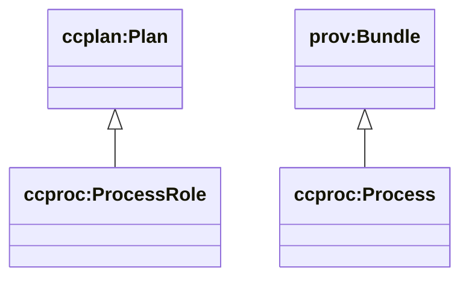
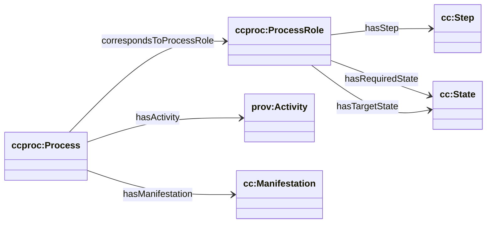

# Process (cc/process) — ProcessRole vs Process

Sources:

- wrapper: `ontology/churchcore-upper-process.ttl`
- T-Box: `ontology/tbox/process.ttl`

This module models the website’s “ProcessRole vs Process” distinction:

- **ProcessRole**: a *specification* (plan-level) bundle of `cc:Step` + required/target `cc:State` categories
- **Process**: an *execution* (run-level) bundle of activities and entities (including `cc:Manifestation`)

## Class hierarchy



## Relationship diagram



## SPARQL: list processes and their roles

```sparql
PREFIX ccproc: <https://ontology.churchcore.ai/cc/process#>

SELECT ?process ?role
WHERE {
  ?process a ccproc:Process .
  OPTIONAL { ?process ccproc:correspondsToProcessRole ?role }
}
ORDER BY ?process
LIMIT 200
```

## SPARQL: what states are required/targeted by a process role?

```sparql
PREFIX ccproc: <https://ontology.churchcore.ai/cc/process#>

SELECT ?role ?required ?target
WHERE {
  ?role a ccproc:ProcessRole .
  OPTIONAL { ?role ccproc:hasRequiredState ?required }
  OPTIONAL { ?role ccproc:hasTargetState ?target }
}
ORDER BY ?role ?required ?target
LIMIT 200
```
## SPARQL: process runs with included activities

```sparql
PREFIX ccproc: <https://ontology.churchcore.ai/cc/process#>

SELECT ?process ?activity
WHERE {
  ?process a ccproc:Process ;
           ccproc:hasActivity ?activity .
}
ORDER BY ?process ?activity
LIMIT 200
```
