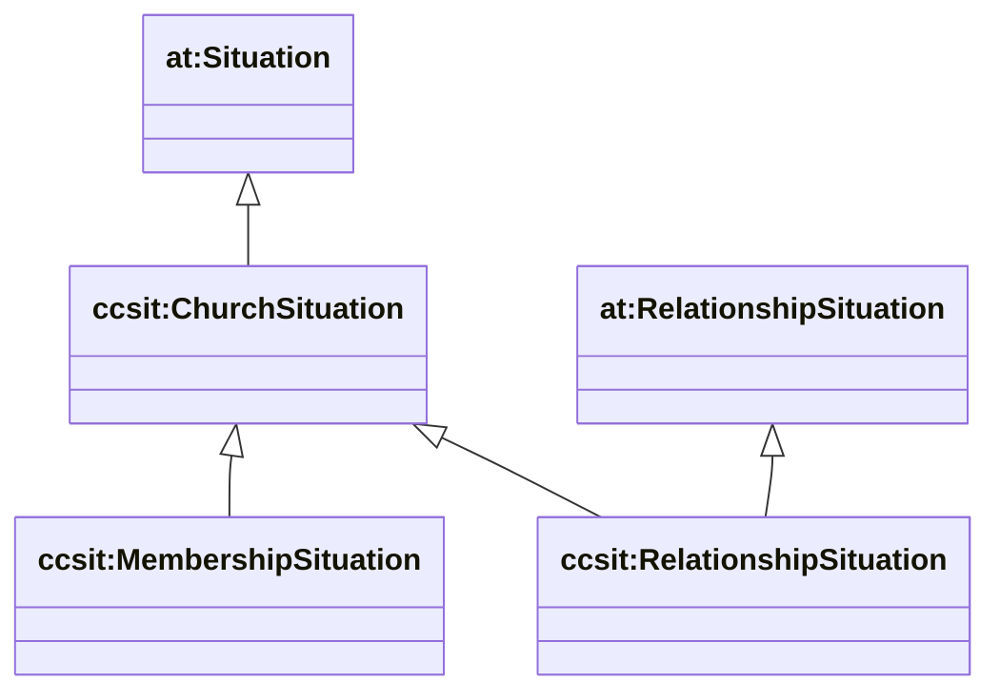

# Situations (cc/situation) — membership + relationship as contexts

Sources:

- wrapper: `ontology/churchcore-upper-situations.ttl`
- T-Box: `ontology/tbox/situation.ttl`

ChurchCore models “being in” a context as a reified **Situation** (Entity), reusing AgenticTrust DnS-style primitives.

## Class hierarchy



## Temporal validity

`ccsit:validFrom` / `ccsit:validTo` attach temporal bounds to the Situation (not the event).

```mermaid
classDiagram
direction LR

class at_Situation["at:Situation"]
at_Situation --> "0..1" xsd_dateTime["xsd:dateTime"] : ccsit:validFrom
at_Situation --> "0..1" xsd_dateTime2["xsd:dateTime"] : ccsit:validTo
```

## SPARQL: list all situations + bounds

```sparql
PREFIX at: <https://agentictrust.io/ontology/core#>
PREFIX ccsit: <https://ontology.churchcore.ai/cc/situation#>
PREFIX rdfs: <http://www.w3.org/2000/01/rdf-schema#>

SELECT ?s ?type ?from ?to
WHERE {
  ?s a ?type .
  ?type rdfs:subClassOf* at:Situation .
  OPTIONAL { ?s ccsit:validFrom ?from }
  OPTIONAL { ?s ccsit:validTo ?to }
}
ORDER BY ?type ?s
LIMIT 200
```

