# Situations (cc/situation) — membership + relationship as contexts

Sources:

- wrapper: `ontology/churchcore-upper-situations.ttl`
- T-Box: `ontology/tbox/situation.ttl`

ChurchCore models “being in” a context as a reified **Situation** (Entity), reusing AgenticTrust DnS-style primitives.

## Specification vs occurrence

The website’s “way things are done” vs “doing of things” distinction is applied to situations too:

- **Specification**: `*SituationSpecification` (subclass of `at:SituationDescription`)
- **Occurrence**: `*Situation` (subclass of `at:Situation`)

This keeps “role/constraint semantics” (specification) separate from “who/what actually participated” (occurrence).

## Class hierarchy

```mermaid
classDiagram
direction TB

class at_Situation["at:Situation"]
class at_SituationDescription["at:SituationDescription"]
class at_RelationshipSituation["at:RelationshipSituation"]

class ccsit_ChurchSituation["ccsit:ChurchSituation"]
class ccsit_ChurchSituationSpecification["ccsit:ChurchSituationSpecification"]
class ccsit_MembershipSituation["ccsit:MembershipSituation"]
class ccsit_RelationshipSituation["ccsit:RelationshipSituation"]
class ccsit_ParticipationSituation["ccsit:ParticipationSituation"]
class ccsit_AssociationSituation["ccsit:AssociationSituation"]
class ccsit_GenerationSituation["ccsit:GenerationSituation"]
class ccsit_UsageSituation["ccsit:UsageSituation"]
class ccsit_CommunicationSituation["ccsit:CommunicationSituation"]
class ccsit_EffectSituation["ccsit:EffectSituation"]
class ccsit_EnablementSituation["ccsit:EnablementSituation"]
class ccsit_AllianceSituation["ccsit:AllianceSituation"]

at_Situation <|-- ccsit_ChurchSituation
at_SituationDescription <|-- ccsit_ChurchSituationSpecification
ccsit_ChurchSituation <|-- ccsit_MembershipSituation
ccsit_ChurchSituation <|-- ccsit_RelationshipSituation
ccsit_ChurchSituation <|-- ccsit_ParticipationSituation
ccsit_ChurchSituation <|-- ccsit_AssociationSituation
ccsit_ChurchSituation <|-- ccsit_GenerationSituation
ccsit_ChurchSituation <|-- ccsit_UsageSituation
ccsit_ChurchSituation <|-- ccsit_CommunicationSituation
ccsit_ChurchSituation <|-- ccsit_EffectSituation
ccsit_ChurchSituation <|-- ccsit_EnablementSituation
ccsit_ChurchSituation <|-- ccsit_AllianceSituation
at_RelationshipSituation <|-- ccsit_RelationshipSituation
```



## Temporal validity

`ccsit:validFrom` / `ccsit:validTo` attach temporal bounds to the Situation (not the event).

```mermaid
classDiagram
direction LR

class at_Situation["at:Situation"]
at_Situation --> "0..1" xsd_dateTime["xsd:dateTime"] : ccsit:validFrom
at_Situation --> "0..1" xsd_dateTime2["xsd:dateTime"] : ccsit:validTo
```

## Core link patterns (occurrence)

Each situation type provides one or more convenience properties that tie the situation to its involved things.

```mermaid
classDiagram
direction LR

class ccsit_ParticipationSituation["ccsit:ParticipationSituation"]
class prov_Agent["prov:Agent"]
class prov_Activity["prov:Activity"]
class prov_Entity["prov:Entity"]

ccsit_ParticipationSituation --> prov_Agent : ccsit:participationAgent
ccsit_ParticipationSituation --> prov_Activity : ccsit:participationActivity

class ccsit_EffectSituation["ccsit:EffectSituation"]
ccsit_EffectSituation --> prov_Activity : ccsit:effectActivity
ccsit_EffectSituation --> prov_Entity : ccsit:effectEntity

class ccsit_EnablementSituation["ccsit:EnablementSituation"]
ccsit_EnablementSituation --> prov_Entity : ccsit:enablingEntity
ccsit_EnablementSituation --> prov_Activity : ccsit:enabledActivity
```

## SPARQL: list all situations + bounds

```sparql
PREFIX at: <https://agentictrust.io/ontology/core#>
PREFIX ccsit: <https://ontology.churchcore.ai/cc/situation#>
PREFIX rdfs: <http://www.w3.org/2000/01/rdf-schema#>

SELECT ?s ?type ?from ?to
WHERE {
  ?s a ?type .
  ?type rdfs:subClassOf* at:Situation .
  OPTIONAL { ?s ccsit:validFrom ?from }
  OPTIONAL { ?s ccsit:validTo ?to }
}
ORDER BY ?type ?s
LIMIT 200
```

## SPARQL: find participation situations for a person

```sparql
PREFIX ccsit: <https://ontology.churchcore.ai/cc/situation#>
PREFIX cc: <https://ontology.churchcore.ai/cc#>

SELECT ?s ?activity
WHERE {
  ?s a ccsit:ParticipationSituation ;
     ccsit:participationAgent ?person ;
     ccsit:participationActivity ?activity .
  ?person a cc:Person .
}
ORDER BY ?person ?activity ?s
LIMIT 200
```

