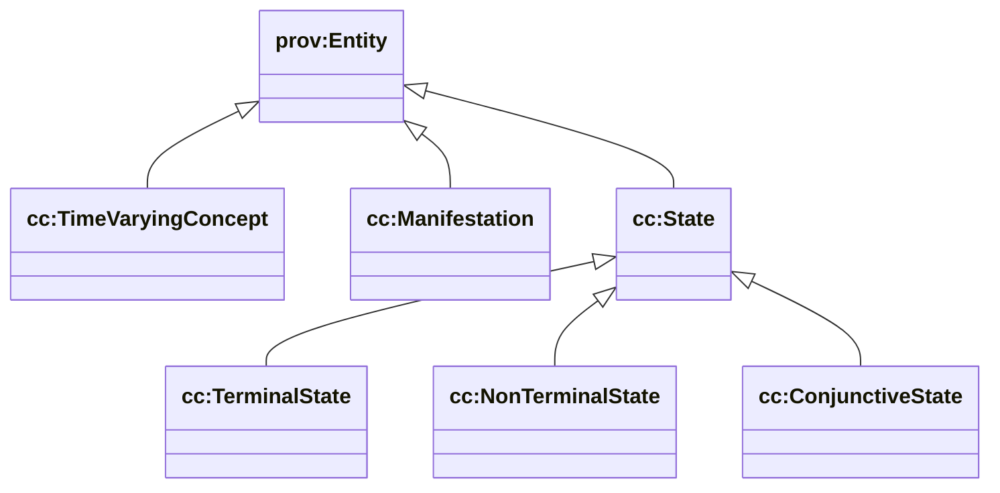
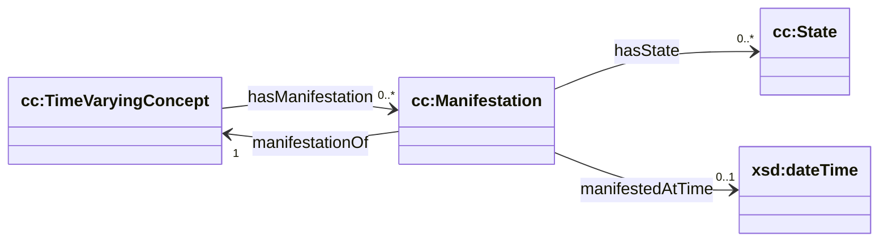

# State (cc/state) — time-varying concepts + manifestations

Sources:

- wrapper: `ontology/churchcore-upper-state.ttl`
- T-Box: `ontology/tbox/state.ttl`

This module provides the “state-based behavioristics” primitives described on the website:

- **Specification-side categories**: `cc:State` (plus terminal/non-terminal/conjunctive)
- **Operational snapshots**: `cc:Manifestation`
- **Identity-through-time**: `cc:TimeVaryingConcept`

## Class hierarchy



## Relationship diagram



## How this connects to situations

The situations module defines:

- `ccsit:EffectSituation` (Activity → outcome Entity)
- `ccsit:EnablementSituation` (enabling Entity → Activity)

In practice, the “outcome/enabling Entity” is often a `cc:Manifestation`.

## SPARQL: list manifestations and their states

```sparql
PREFIX cc: <https://ontology.churchcore.ai/cc#>

SELECT ?m ?tvc ?state ?t
WHERE {
  ?m a cc:Manifestation ;
     cc:manifestationOf ?tvc .
  OPTIONAL { ?m cc:hasState ?state }
  OPTIONAL { ?m cc:manifestedAtTime ?t }
}
ORDER BY ?tvc ?t ?m
LIMIT 200
```

## SPARQL: terminal vs non-terminal state categories used

```sparql
PREFIX cc: <https://ontology.churchcore.ai/cc#>

SELECT ?stateClass (COUNT(?state) AS ?count)
WHERE {
  ?m a cc:Manifestation ;
     cc:hasState ?state .
  ?state a ?stateClass .
  FILTER(?stateClass IN (cc:TerminalState, cc:NonTerminalState, cc:ConjunctiveState))
}
GROUP BY ?stateClass
ORDER BY DESC(?count)
```

